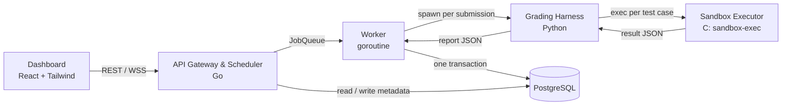

# Secure Sandboxed Auto-Grading Platform

[](LICENSE)


A web platform that grades Python programming assignments automatically. Student code runs
inside a sandbox built directly on Linux kernel isolation primitives: namespaces, cgroup v2, and
seccomp-BPF. The platform does not wrap Docker.

Lecturers define assignments and test cases. Students upload solutions and watch grading progress
in real time. Each test case runs in a fresh, resource-limited, syscall-filtered environment that
cannot reach the network, the host filesystem, or other students' work.

The architecture is inspired by Harvard's CS50 Sandbox (Malan, SIGCSE 2013) and
[`check50`](https://github.com/cs50/check50). It is rebuilt from scratch at the scale of one university course.

> [!IMPORTANT]
> **Project status: under active development.** This repository is a 14-week Software Engineering
> course project (Universitas Katolik Widya Mandala Surabaya, 18 Aug – 23 Nov 2026). No component
> is usable yet. See the [Roadmap](#roadmap).

---

## Contents

- [Features](#features)
- [Architecture](#architecture)
- [Sandbox isolation model](#sandbox-isolation-model)
- [Security scope and limitations](#security-scope-and-limitations)
- [Tech stack](#tech-stack)
- [Repository layout](#repository-layout)
- [Getting started](#getting-started)
- [Contributing](#contributing)
- [Roadmap](#roadmap)
- [Team](#team)
- [Acknowledgements](#acknowledgements)
- [License](#license)

## Features

Planned for the first release:

- **Courses and enrollment.** Students see and submit only to assignments in courses they are
  enrolled in.
- **Assignments and test cases.** Weighted test cases can be visible or hidden, compared with
  exact or whitespace-insensitive matching, and imported or exported as YAML.
- **Per-assignment resource limits.** Lecturers set CPU time, wall-clock time, memory, process
  count, output size, and scratch disk.
- **Detailed verdicts.** Each test case gets one of `PASSED`, `FAILED`, `TIMEOUT`,
  `MEMORY_LIMIT_EXCEEDED`, `RUNTIME_ERROR`, `SYNTAX_ERROR`, or `SECURITY_VIOLATION`, together with
  execution time and peak memory.
- **Real-time progress** over WebSocket, for example "test 3 of 5".
- **Fair scheduling.** The queue serves students round-robin and applies per-student rate limits,
  so one student cannot starve the others.
- **Regrading.** After a test case is fixed, lecturers can regrade one submission or a whole
  assignment. Outdated grades are flagged `stale_grade`.
- **Late submissions.** A grace window accepts late work and marks it `is_late`. The platform
  never applies an automatic penalty.
- **Grade reports** with CSV export, plus read access to submitted source code for lecturers.
- **Security audit log.** Each denied syscall is recorded with its syscall number.

Out of scope for this release: languages other than Python, third-party packages (standard library
only), multi-node workers, and LMS integration.

## Architecture



| Component | Language | Responsibility |
|---|---|---|
| [`sandbox/`](sandbox/) | C | Runs **one** command in an isolated, resource-limited environment and reports how it ended. Knows nothing about test cases or scores. |
| [`scheduler/`](scheduler/) | Go | REST and WebSocket API, authentication, job queue, worker pool, rate limiting. **The only component that writes to the database.** |
| [`grader/`](grader/) | Python | Calls `sandbox-exec` once per test case, feeds input on stdin, compares output, computes the weighted score, and returns one JSON report. |
| [`frontend/`](frontend/) | React | Dashboards for students, lecturers, and administrators. |
| [`infra/`](infra/) | — | Deployment scripts, Nginx, and systemd units for staging and production. |

Two rules hold across the codebase:

1. **The grading harness calls the sandbox, never the reverse.** Test cases inside one submission
   run sequentially, so resource measurements do not interfere.
2. **Only the scheduler writes to the database.** The harness returns JSON. The worker then
   persists every result and the total score in a single transaction.

## Sandbox isolation model

Every test case execution gets its own environment:

| Layer | Mechanism | Stops |
|---|---|---|
| Process view | PID, mount, network, UTS, and IPC namespaces, entered through an unprivileged user namespace | Seeing or signalling host processes |
| Filesystem | `pivot_root` into a minimal root: read-only `/usr` and `/lib` plus a tiny `/dev`. The working directory is a size-capped `tmpfs` | Reading `/etc/passwd`, other submissions, or hidden expected outputs |
| Network | New network namespace with no interfaces | Reverse shells and data exfiltration |
| Memory | cgroup v2 `memory.max` with `memory.swap.max=0` | Memory bombs, including swap-based bypass |
| Processes | cgroup v2 `pids.max` | Fork bombs |
| CPU | `RLIMIT_CPU` plus `cpu.stat` monitoring for the time budget, and `cpu.max` for bandwidth | Infinite loops and core hogging |
| Wall clock | Supervisor timer that sends `SIGKILL` to the sandbox's PID 1 | `sleep()`-style stalls |
| Output | Combined stdout+stderr byte cap | Output bombs |
| Syscalls | seccomp-BPF allowlist. Denials use `SCMP_ACT_NOTIFY`, so the supervisor learns which syscall was denied | `ptrace`, `mount`, `reboot`, and similar calls |
| Privilege | Unprivileged service user, all capabilities dropped, `PR_SET_NO_NEW_PRIVS` | Privilege escalation |

Test input arrives on stdin. Expected outputs never enter the sandbox. Exit status and resource
usage come from the supervisor (`wait4()` and cgroup counters), never from anything the student
program prints.

Execution is deterministic: `PYTHONHASHSEED=0`, `python -I -B`, `LC_ALL=C.UTF-8`, `TZ=UTC`, and an
otherwise empty environment. The same code therefore produces the same output on every run.

## Security scope and limitations

The sandbox shares the host kernel, as standard Docker isolation does. **This project makes no
claim of protection against Linux kernel vulnerabilities.** It explicitly defends against resource
exhaustion (fork, memory, CPU, output, and disk-write bombs), filesystem escape, outbound network
access, dangerous syscalls, submission flooding, hidden test case leakage, result forgery, and
cross-user or cross-course object access.

If you find a vulnerability, **do not open a public issue.** Follow [SECURITY.md](SECURITY.md).

## Tech stack

| Area | Technology | Minimum version |
|---|---|---|
| Sandbox Executor | C, glibc, libseccomp | libseccomp 2.5 |
| API Gateway & Scheduler | Go, pgx, gorilla/websocket | Go 1.22 |
| Grading Harness, graded runtime | Python, PyYAML | Python 3.11 |
| Dashboard | React, TailwindCSS | Node.js 20 |
| Database | PostgreSQL | 15 |
| Host OS | Linux with cgroup v2 unified hierarchy | Kernel 5.10 |
| Deployment | Nginx, systemd, GitHub Actions | — |

The minimum versions come from the project specification. Go 1.22 and Node.js 20 are no longer
supported upstream, so develop against current releases. `scheduler/go.mod` pins the Go version,
and CI builds the frontend with Node.js 24 LTS.

## Repository layout

```
.
├── sandbox/      Sandbox Executor (C)
├── scheduler/    API Gateway, Scheduler, worker pool, DB migrations (Go)
├── grader/       Grading Harness (Python)
├── frontend/     Dashboard (React + TailwindCSS)
├── infra/        Deployment: Nginx, systemd, provisioning scripts
├── docs/         Weekly progress notes and sprint reviews
└── .github/      CI workflows, issue and pull request templates
```

## Getting started

Build and run instructions will be added to each component's README as that component lands.

### Host requirements

The sandbox runs only on Linux. On Windows, use WSL2. The host must provide:

- Linux kernel **≥ 5.10** with the **cgroup v2 unified hierarchy**
- Unprivileged user namespaces enabled
- A systemd service unit with `Delegate=yes` for the worker, so it can write its cgroup subtree
  without root

Check a host before developing or deploying on it:

```sh
uname -r                                              # kernel version, need ≥ 5.10
stat -fc %T /sys/fs/cgroup                            # expect: cgroup2fs
sysctl kernel.apparmor_restrict_unprivileged_userns   # Ubuntu 24.04+: 1 blocks user namespaces
swapon --show                                         # swap present means memory.swap.max=0 is essential
```

On Ubuntu 24.04 and later, AppArmor restricts unprivileged user namespaces by default. The sandbox
binary then needs a dedicated AppArmor profile, or the restriction must be relaxed on that host.

### Toolchain

- GCC or Clang, `make`, `libseccomp-dev`
- Go (current release)
- Python 3.11+
- Node.js 24 LTS
- PostgreSQL 15+

## Contributing

Read [CONTRIBUTING.md](CONTRIBUTING.md) for the branching model, commit conventions, and quality
gates. In short: branch from `develop`, follow [Conventional Commits](https://www.conventionalcommits.org/),
and open a pull request that another team member reviews.

## Roadmap

| Weeks | Dates (2026) | Phase | Milestone |
|---|---|---|---|
| 1–2 | 18 Aug – 31 Aug | Initiation and requirements | SRS approved, backlog of user stories |
| 3–4 | 1 Sep – 14 Sep | System and UI/UX design | ERD, UI design, CI/CD, server verification |
| 5–6 | 15 Sep – 28 Sep | Sprint 1: sandbox core and base API | Sandbox runs Python under CPU and memory limits; auth API; DB on staging |
| 7–8 | 29 Sep – 12 Oct | Sprint 2: grading and dashboard integration | End-to-end flow: upload, execute, grade shown |
| 9–10 | 13 Oct – 26 Oct | Sprint 3: supporting features | Feature freeze, all must-have requirements done |
| 11–12 | 27 Oct – 9 Nov | QA, adversarial security testing, UAT | UAT report, no open critical defects |
| 13–14 | 10 Nov – 23 Nov | Production deployment and handover | Public deployment, documentation, handover |

## Team

| Member | Role |
|---|---|
| Efraim Melvyn Rafelino Lahai | Sandbox & Security Engineer (C) · Risk Manager |
| Evan William | Backend & Scheduler Engineer (Go) · Sandbox backup |
| Robertus Geraldyn Alexandro Gabeler | Grading Harness & Test Engineer (Python) · QA Coordinator |
| Benedictus Erlangga | Project Manager · Frontend Engineer (React) |

Supervised by Ir. Drs. Peter Rhatodirdjo Angka, M.Kom., IPM., ASEAN Eng. (Software Engineering,
Informatics, UKWMS).

## Acknowledgements

- D. J. Malan, *CS50 Sandbox: Secure Execution of Untrusted Code*, SIGCSE 2013. This paper is the
  architectural precedent for an execution server with an autograding layer on top.
- [check50](https://github.com/cs50/check50), CS50's autograding tool.
- [Judge0](https://github.com/judge0/judge0), used for comparison of namespace- and cgroup-based
  judging.
- Linux manual pages: `namespaces(7)`, `cgroups(7)`, `seccomp(2)`, `seccomp_unotify(2)`.

## License

Released under the [MIT License](LICENSE).
